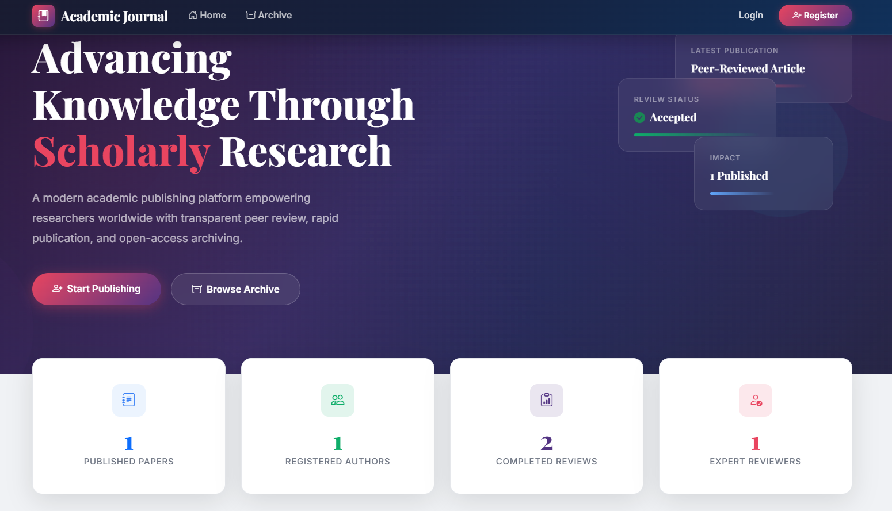
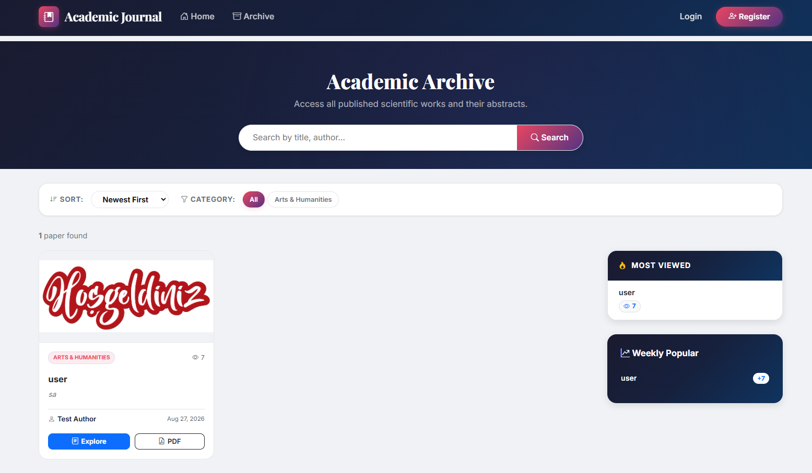
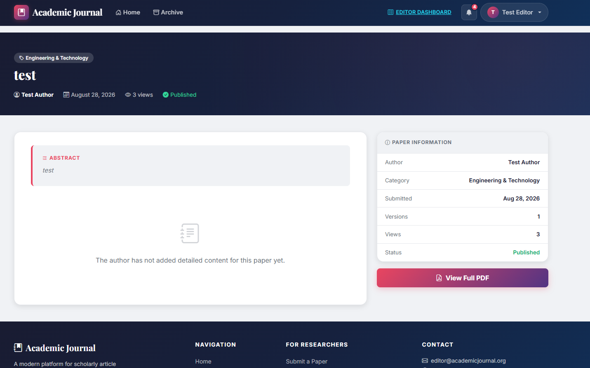
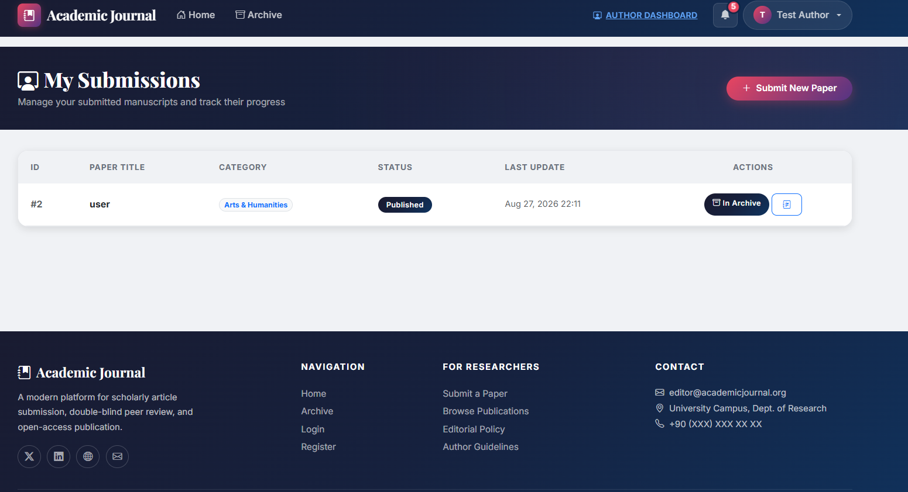
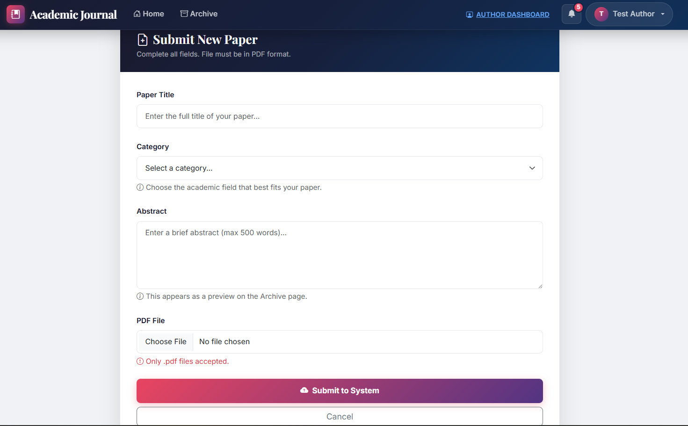
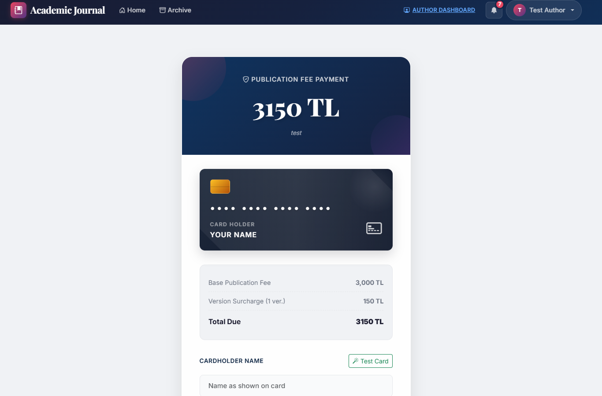
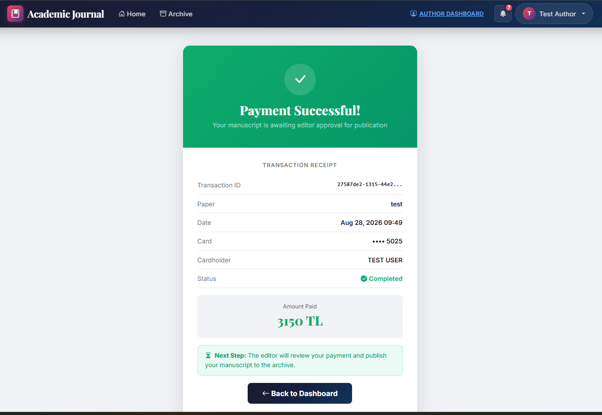
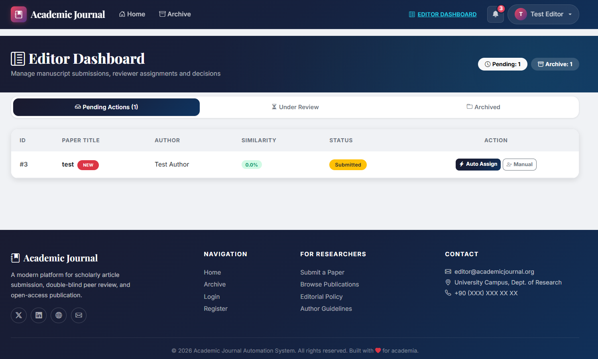
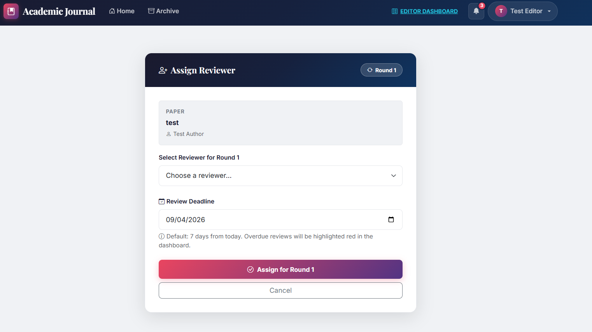
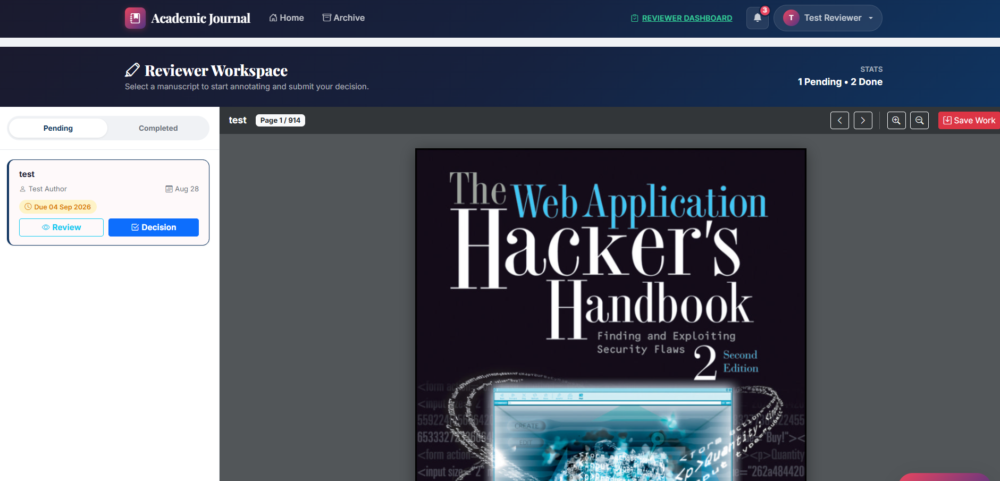

# Academic Journal Automaton 🎓


**Academic Journal Automaton** is a comprehensive, role-based web application designed to streamline the entire lifecycle of an academic manuscript—from author submission to peer review, editorial decision, and final publication. It features a modern, responsive UI with premium glassmorphism elements, dynamic interactive PDF annotations, and automated assignment workflows.

## 📸 Screenshots

<details>
<summary>Click to view screenshots of the platform</summary>
<br>

### Home & Archive

*Home Page*


*Archive Page*


*Paper Detail Page*

### Author Workflow

*Author Dashboard*


*Submit Paper Form*


*Payment Form*


*Payment Success*

### Editor & Reviewer Workflow

*Editor Dashboard*


*Assign Reviewer*


*Reviewer Workspace with Interactive PDF Annotations*

</details>

---

## 🚀 Key Features

### 1. Role-Based Access Control (RBAC)
The system operates on four distinct user roles, each with a specialized dashboard:
- **Author:** Submit manuscripts, view review statuses, respond to feedback, handle payments, and upload revised versions.
- **Reviewer:** Receive assignments, read papers, use the built-in PDF annotation tool to highlight and comment on specific sections, and submit final recommendations.
- **Editor:** Monitor all submitted papers, manually or automatically (based on workload) assign reviewers, track review progress, and make the final "Approve" or "Reject" decision.
- **Admin:** Manage the entire system, oversee all user accounts, and hide/publish any paper in the archive.

### 2. Interactive PDF Annotation System
A standout feature of the platform. Reviewers don't just leave text comments; they can open the manuscript's PDF directly in the browser and draw highlight boxes over text. These annotations are categorized by severity (Minor, Major, Critical, Suggestion) and are interactively viewable by the Author during the revision phase.

### 3. Payment Mock Integration
Includes a secure, mocked payment gateway required before a manuscript enters the peer-review phase. It includes a simulated validation process (Luhn check bypass enabled for testing).

### 4. Smart Archive & Analytics
- **Public Archive:** A beautifully designed, full-width masonry grid displaying published papers.
- **Analytics:** Tracks "Most Viewed" and "Trending Weekly" papers using timestamped click-tracking logic.
- **Management Mode:** Editors and Admins can toggle a hidden management layer directly on the archive to edit or hide papers seamlessly.

### 5. Automated Workflows & Notifications
- Automated reviewer assignment algorithm based on current workload.
- Integrated notification system alerting users of status changes, new review assignments, and required revisions.

---

## 🛠️ Technology Stack

- **Backend:** Python, Flask, SQLAlchemy (ORM)
- **Database:** SQLite (Easily swappable to PostgreSQL/MySQL via SQLAlchemy)
- **Frontend:** HTML5, CSS3 (Vanilla, custom UI framework), Bootstrap 5 (for grid and utilities), JavaScript (Vanilla for interactivity and PDF annotations)
- **Libraries/Tools:** `pdf.js` (for PDF rendering), `Werkzeug` (Security), `Flask-Login` (Authentication)

---

## 📂 Folder Structure

```text
├── app/
│   ├── __init__.py          # App factory and blueprint registration
│   ├── models.py            # SQLAlchemy database models
│   ├── routes/              # Modular blueprints (author, reviewer, editor, admin, main, auth)
│   ├── templates/           # HTML templates (Jinja2)
│   └── static/              # CSS, JS, and image assets
├── uploads/                 # Storage for submitted manuscripts and cover images
├── venv/                    # Python virtual environment
├── config.py                # Application configuration variables
├── run.py                   # Main entry point to run the Flask app
├── generate_test_users.py   # Script to populate the DB with mock data
└── README.md                # Project documentation
```

---

## ⚙️ Installation & Setup

1. **Clone the repository:**
   ```bash
   git clone https://github.com/yourusername/academic-journal-automaton.git
   cd academic-journal-automaton
   ```

2. **Create and activate a virtual environment:**
   ```bash
   python -m venv venv
   # On Windows:
   venv\Scripts\activate
   # On Mac/Linux:
   source venv/bin/activate
   ```

3. **Install dependencies:**
   *(Make sure to generate a `requirements.txt` via `pip freeze > requirements.txt` if not present)*
   ```bash
   pip install -r requirements.txt
   ```

4. **Initialize the Database and Test Users:**
   The project comes with a handy script to set up the SQLite database and populate it with test data.
   ```bash
   python generate_test_users.py
   ```

5. **Run the Application:**
   ```bash
   python run.py
   ```
   The application will be available at `http://127.0.0.1:5000/`.

---

## 🧪 Test Credentials

After running `generate_test_users.py`, you can use the following accounts to test the different workflows:

| Role | Email | Password |
|------|-------|----------|
| **Author** | `author@test.com` | `password123` |
| **Reviewer** | `reviewer@test.com` | `password123` |
| **Editor** | `editor@test.com` | `password123` |
| **Admin** | `admin@test.com` | `password123` |

---

## 🤝 Contributing
Contributions, issues, and feature requests are welcome! Feel free to check the issues page if you want to contribute.

## 📝 License
This project is open-source and available under the [MIT License](LICENSE).
